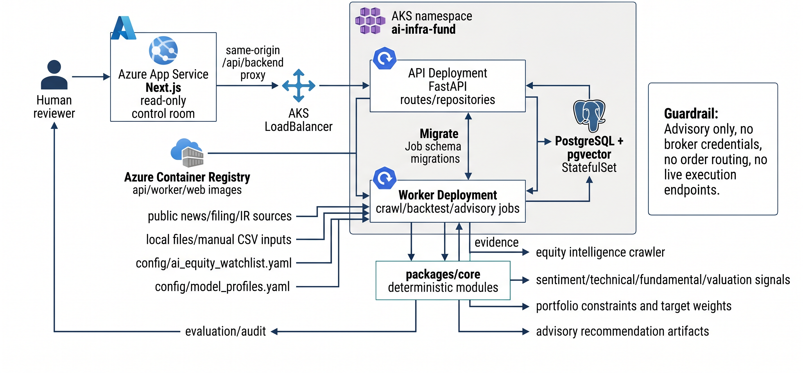
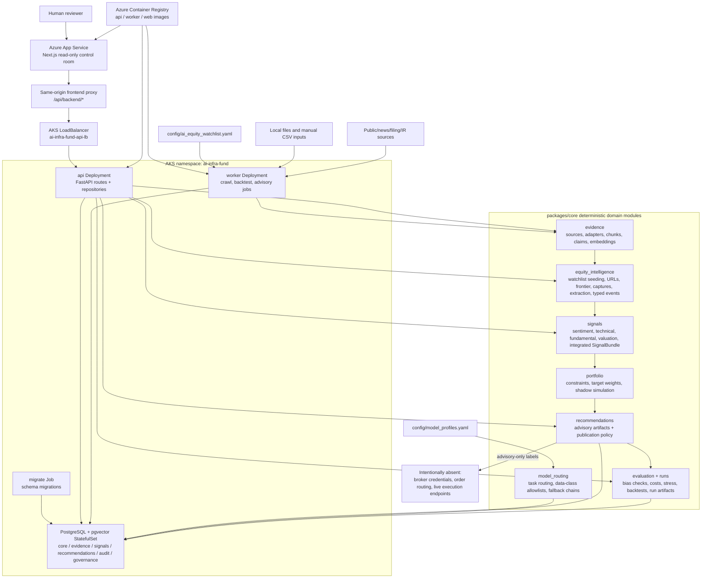

# AI Infrastructure Fund Control Room

AI Infrastructure Fund is a local-first, advisory-only equity research and portfolio recommendation system for AI infrastructure, the AI ecosystem, and quantum technology investing.

The system is designed to ingest evidence, classify and summarize it with governed model routes, compute deterministic signals, generate deterministic target weights, and expose auditable portfolio recommendations in an operations-style dashboard.

It is not a trading bot. It does not place live orders, connect to broker accounts, route orders, or expose any UI that implies execution. All recommendations are advisory artifacts that a human can review and act on manually outside the system.

## Core Capabilities

- Portfolio and universe tracking for AI infrastructure equities.
- Local manual trade journal and manual trade intent records.
- Public evidence ingestion with provenance, content hashes, source spans, chunks, claims, and embeddings.
- Equity intelligence crawler scaffolding driven by `config/ai_equity_watchlist.yaml`.
- Typed advisory events such as earnings guidance changes, capex signals, AI product launches, accelerator supply signals, cloud capacity signals, export-control signals, data-center power signals, and competitive-position signals.
- Deterministic signal generation for sentiment, technical, fundamental, valuation, forward-indicator, and risk inputs.
- Deterministic portfolio target weight generation and constraint checks.
- Recommendation artifacts that link evidence IDs, model run IDs, signal bundle IDs, target weights IDs, and audit records.
- Evaluation and governance harnesses for backtests, walk-forward splits, lookahead-bias checks, recursive indicator checks, Monte Carlo stress, benchmark comparison, cost and slippage assumptions, and shadow-mode model comparison.
- Read-only control-room UI for status, portfolio, trade journal, watchlist, ticker research, evidence, signals, runs, evaluation, ops, and incidents.

## Safety Boundary

The project has a hard advisory-only boundary:

- No live order placement.
- No broker credentials.
- No order routing or execution algorithm endpoint.
- No hidden execution API.
- No UI action that submits, stages, or implies a real market order.
- Target weights are generated by deterministic portfolio code, not directly by an LLM.
- LLMs may extract, summarize, classify, review, and explain, but deterministic code owns scores, risk checks, backtests, constraints, and target weights.
- Private reports and secrets must stay out of git.

## How The System Works

The main decision chain is:

```text
Watchlist + local inputs + public sources
  -> EvidenceItem + EvidenceChunk + EvidenceClaim
  -> ModelRun records for extraction, review, and summaries
  -> SignalBundle from deterministic scoring code
  -> TargetWeights from deterministic portfolio code
  -> RecommendationArtifact with advisory-only labeling
  -> RecommendationAudit and Evaluation artifacts
  -> Read-only dashboard views
```

Important ownership rules:

- `config/ai_equity_watchlist.yaml` owns the configured public equity universe and source URLs.
- `config/model_profiles.yaml` owns model identities, deployments, roles, data-class permissions, and fallback chains.
- PostgreSQL + pgvector is the v1 durable store for portfolio records, evidence, embeddings, market snapshots, model runs, signal bundles, target weights, recommendations, audits, backtests, evaluations, and run artifacts.
- Raw PDFs, CSVs, downloaded files, private notes, and exports may live in ignored local `data/` paths. PostgreSQL stores metadata, hashes, provenance, and audit links.
- DuckDB + Parquet is reserved for a future analytical scale-out path and is not a v1 runtime dependency.

## Repository Layout

```text
apps/web/                  Next.js read-only control-room UI
services/api/              FastAPI backend, migrations, repositories, internal routes
services/worker/           Worker entrypoints and advisory run jobs
packages/core/             Shared contracts, model routing, evidence, signals, portfolio, evaluation
config/                    Watchlist and model-routing source of truth
docs/specs/                Product, architecture, policy, data, UI, and deployment specs
docs/plans/                Phase plans and implementation notes
scripts/                   Compose smoke tests and demo/advisory run scripts
deploy/                    AKS deployment manifest example
tests/                     Architecture, contract, API, repository, worker, UI, and policy tests
```

## Runtime Architecture

The v1 runtime boundary is Docker Compose:

- `postgres`: PostgreSQL 16 with pgvector.
- `migrate`: one-shot database migration container.
- `api`: FastAPI-compatible backend on port `8000`.
- `worker`: background worker container for ingestion, embeddings, deterministic scoring, backtests, and scheduled runs.
- `web`: Next.js frontend on port `3000`.

The current deployed shape mirrors that boundary: web runs as an Azure App Service, backend services run in AKS, and images are built and pushed through Azure Container Registry.



The generated diagram is a visual overview. The Mermaid diagram below is the exact source-of-truth representation for architecture reviews.



Module responsibilities are split deliberately:

- `packages/core` contains the shared contracts and deterministic domain logic. It is the scoring, portfolio, evidence, crawler, recommendation, evaluation, and model-routing policy layer.
- `services/api` exposes health/readiness, dashboard reads, evidence/recommendation/evaluation/run routes, agent bootstrap endpoints, local journal routes, and repository-backed database access.
- `services/worker` owns asynchronous work: crawl scheduling, capture/extraction, backtest orchestration, local advisory runs, and iterative job processing.
- `apps/web` renders the read-only control room and reaches the backend through configured API base URLs or the same-origin `/api/backend/*` proxy.
- `services/api/migrations` defines the PostgreSQL + pgvector data spine, including portfolio state, evidence provenance, model runs, signal snapshots, target weights, recommendation audits, crawl logs, backtest requests, and experiment events.

The API exposes health and readiness endpoints at `/health` and `/ready`, plus internal routes for evidence, recommendations, evaluations, advisory-chain reads, runs, dashboard summaries, ticker intelligence, and the local trade journal.

External AI agents can bootstrap against the read-only advisory surface via `GET /internal/agent/skill` (Markdown, mirrors `docs/agent/SKILL.md`) and the OpenAPI spec at `GET /internal/agent/openapi.json` / `GET /internal/agent/openapi.yaml`. The committed YAML snapshot lives at `docs/api/openapi.yaml`; regenerate it with `python scripts/export_openapi.py`.

The frontend calls the API through `NEXT_PUBLIC_API_BASE_URL` in browser code and `AI_INFRA_FUND_INTERNAL_API_BASE_URL` from the container network.

## Configuration

Use `.env.example` as the local configuration template. Do not put real secrets in the repo.

Key settings:

- `AI_INFRA_FUND_ENV`: runtime environment label.
- `AI_INFRA_FUND_DATABASE_URL`: PostgreSQL connection string.
- `AI_INFRA_FUND_DATA_DIR`: ignored local data directory mounted into containers.
- `AI_INFRA_FUND_MODEL_PROFILES`: path to model-routing config.
- `AI_INFRA_FUND_CORS_ORIGINS`: comma-separated allowed frontend origins.
- `AI_INFRA_FUND_INTERNAL_TOKEN`: required in production for `/internal/*` API access; keep it server-side only.
- `AZURE_AI_FOUNDRY_ENDPOINT` and `AZURE_AI_FOUNDRY_API_KEY`: optional cloud model endpoint settings.
- `OLLAMA_BASE_URL`: local model endpoint for private/local fallback routes.
- `NEXT_PUBLIC_API_BASE_URL`: browser-visible API base URL.

## Local Development

Prerequisites:

- Python 3.12+
- Node.js and npm
- Docker Compose

Install frontend dependencies:

```bash
npm install --prefix apps/web
```

Run Python tests:

```bash
pytest -q
```

Build the web app:

```bash
npm run build --prefix apps/web
```

Run the full Compose smoke check:

```bash
scripts/compose_smoke.sh
```

Start the local stack:

```bash
docker compose up --build
```

Then open:

- Web UI: `http://localhost:3000`
- API health: `http://localhost:8000/health`
- API readiness: `http://localhost:8000/ready`

## Demo And Advisory Runs

Seed the demo advisory chain:

```bash
scripts/seed_demo_chain.sh
```

Run the demo advisory job:

```bash
scripts/run_advisory_demo.sh
```

Run the local advisory sample, which creates sample files under ignored `data/local_advisory_sample/` when missing:

```bash
scripts/run_local_advisory_sample.sh
```

Run the one-shot local equity advisory flow against an existing or generated local input directory:

```bash
scripts/run_equity_advisory_once.sh
```

## Testing And Governance

The test suite enforces the architecture boundary as code. It covers contracts, model routing, local input validation, evidence processing, repositories, recommendation policy, evaluation, dashboard APIs, worker runs, deployment readiness, and UI behavior.

Before changing core behavior, read the relevant files in `docs/specs/` and update or add tests first. Each recommendation-facing change must preserve:

- advisory-only labeling;
- evidence ID linkage;
- model run ID linkage;
- signal bundle ID linkage;
- target weights ID linkage;
- deterministic risk and constraint checks.

## Deployment Notes

Docker Compose is the canonical v1 runtime. `deploy/aks-ai-infra-fund.yaml` provides an AKS example with a namespace, config map, PostgreSQL stateful set, migration job, API deployment, and services.

Production-like deployments should provide secrets through the platform secret manager, not committed files. The deployment manifest expects database secrets such as `POSTGRES_DB`, `POSTGRES_USER`, `POSTGRES_PASSWORD`, and `AI_INFRA_FUND_DATABASE_URL` to come from a Kubernetes secret.

## Project Source Of Truth

The product and architecture rules live in:

- `AGENTS.md`
- `docs/specs/0001-product-vision.md`
- `docs/specs/0002-trading-policy.md`
- `docs/specs/0003-data-contracts.md`
- `docs/specs/0004-agent-contracts.md`
- `docs/specs/0012-data-architecture.md`
- `docs/specs/0015-containerized-deployment.md`
- `docs/specs/0016-equity-intelligence-crawler.md`

When a plan and a spec disagree, resolve the conflict before implementing.
