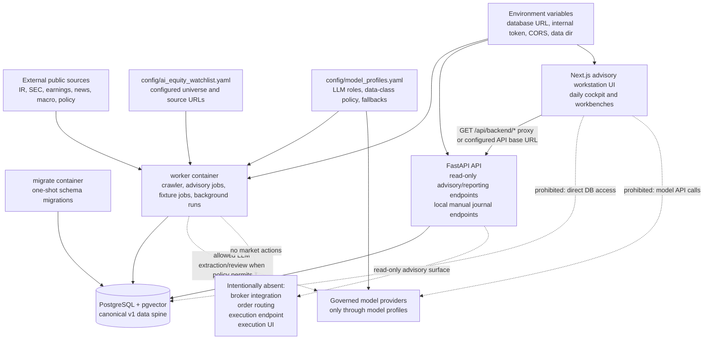
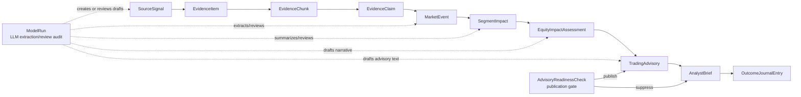
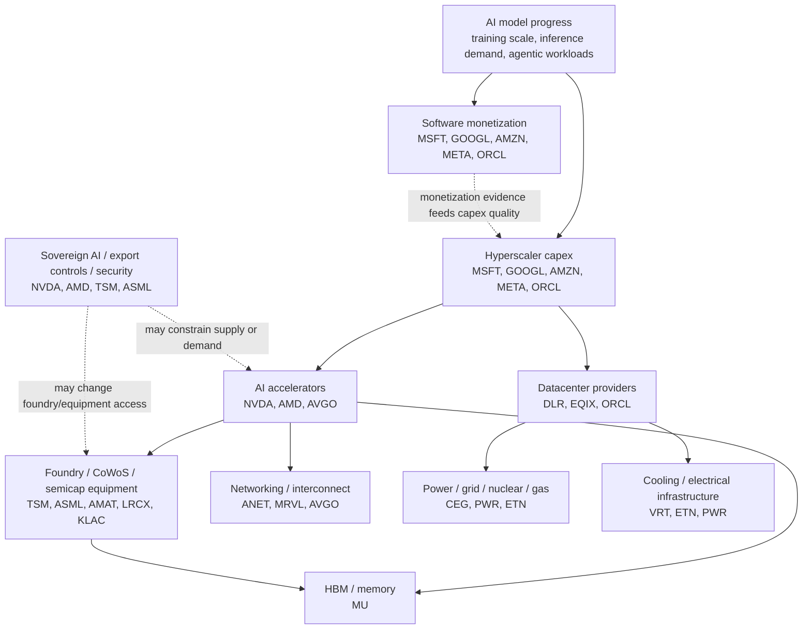
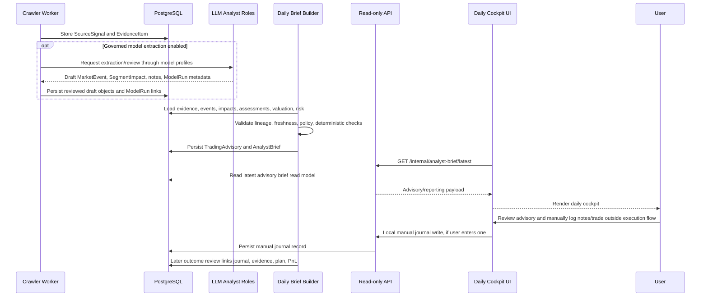
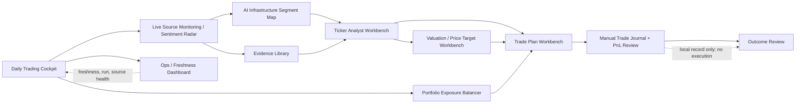
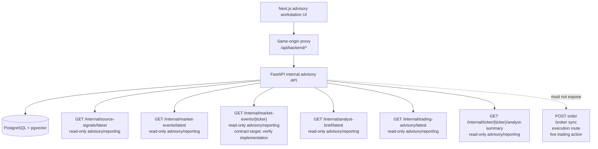

# App Diagrams

This document is the visual source map for the AI Infrastructure Trading Advisory Workstation. It uses Mermaid only so GitHub can render the diagrams directly.

The system is advisory and reporting-only:

- no broker integration
- no live order placement
- no execution endpoint
- no execution UI
- manual trade journal only
- LLMs extract, summarize, classify, review, critique, and explain
- deterministic code owns schemas, validation, accounting, PnL, risk checks, readiness checks, target weights, and audit lineage

## 1. Product Operating Loop

The product loop starts from configured public information and ends with manual journal/outcome review. Nothing in the loop sends orders or touches a broker.

```mermaid
flowchart LR
  sources["Configured Public Sources"]
  signal["SourceSignal"]
  evidence["EvidenceItem"]
  event["MarketEvent"]
  segment["SegmentImpact"]
  equity["EquityImpactAssessment"]
  valuation["ValuationContext"]
  risk["RiskRegimeUpdate"]
  advisory["TradingAdvisory"]
  brief["AnalystBrief"]
  plan["Manual Trade Plan"]
  journal["Manual Trade Journal"]
  outcome["Outcome Review"]
  boundary["Hard boundary:<br/>advisory/reporting only<br/>no broker, no order, no execution"]

  sources --> signal --> evidence --> event --> segment --> equity
  equity --> valuation --> advisory
  equity --> risk --> advisory
  advisory --> brief --> plan --> journal --> outcome
  outcome -. "calibrates future reviews" .-> sources
  plan -. "manual analyst action outside system" .-> boundary
  journal -. "local record only" .-> boundary
```



## 2. Runtime Architecture

The worker owns source monitoring, crawling, advisory jobs, and optional governed model work. The API owns read-only advisory endpoints. The web UI never connects directly to PostgreSQL and never calls model APIs.



## 3. Data Lineage Diagram

Lineage is preserved from source signal through evidence, model runs, advisory publication gates, analyst brief, and manual outcome review.



## 4. LLM vs Deterministic Boundary

LLMs can help create and critique language-rich analyst objects. Deterministic code owns all numeric, policy, risk, accounting, and readiness decisions.

```mermaid
flowchart LR
  subgraph llm["LLM-driven"]
    llm1["source classification"]
    llm2["catalyst extraction"]
    llm3["evidence summarization"]
    llm4["segment reasoning"]
    llm5["equity thesis update"]
    llm6["valuation narrative"]
    llm7["risk critique"]
    llm8["advisory narrative"]
    llm9["post-trade review"]
  end

  subgraph deterministic["Deterministic"]
    d1["schema validation"]
    d2["evidence linkage"]
    d3["freshness/staleness checks"]
    d4["PnL"]
    d5["portfolio exposure"]
    d6["position weights"]
    d7["readiness/suppression checks"]
    d8["accounting"]
    d9["target weights if used"]
    d10["audit lineage"]
  end

  llm -. "must produce reviewable drafts with ModelRun records" .-> deterministic
  deterministic -->|"only validated objects can publish"| publish["Advisory/reporting output"]
  publish --> absent["No broker, no order, no execution"]
```



## 5. AI Infrastructure Segment Map

AI progress propagates through the infrastructure stack. The segment map keeps first-order and second-order ticker exposure explicit.



## 6. Advisory Readiness Gate

Candidate advisories fail closed. Suppressed advisories can still be reviewed, but they must not be presented as ready for manual planning.

```mermaid
flowchart TD
  candidate["Candidate TradingAdvisory"]
  e{"Evidence present?"}
  fresh{"Source fresh?"}
  class{"Data class allowed?"}
  contradictions{"Risk contradictions resolved?"}
  deterministic{"Deterministic checks passed?"}
  label{"Advisory-only label present?"}
  language{"No forbidden execution language?"}
  publish["Publish advisory/reporting record"]
  suppress["Suppress from readiness"]

  missing["suppression: missing evidence"]
  stale["suppression: stale evidence"]
  failed["suppression: failed deterministic check"]
  unresolved["suppression: unresolved contradiction"]
  policy["suppression: policy violation"]
  noLabel["suppression: missing advisory label"]

  candidate --> e
  e -- no --> missing --> suppress
  e -- yes --> fresh
  fresh -- no --> stale --> suppress
  fresh -- yes --> class
  class -- no --> policy --> suppress
  class -- yes --> contradictions
  contradictions -- no --> unresolved --> suppress
  contradictions -- yes --> deterministic
  deterministic -- no --> failed --> suppress
  deterministic -- yes --> label
  label -- no --> noLabel --> suppress
  label -- yes --> language
  language -- no --> policy
  language -- yes --> publish
```

## 7. Daily Brief Generation Sequence

The daily brief is generated from persisted evidence and validated advisory objects. User trade activity remains a manual journal/outcome-review loop.



## 8. UI Navigation Map

The operator flow starts in the cockpit, moves through evidence and segment context, then into ticker work, trade planning, local journaling, and outcome review.



## 9. API Surface Diagram

The advisory API is a read-only reporting surface for the workstation. The only mutation-like workflow in the product boundary is local manual journal capture, which is outside this read-only advisory endpoint set.



## 10. Build Roadmap Diagram

The roadmap is oriented around the advisory loop, not backtesting-first quant tooling.

```mermaid
flowchart TD
  p1["1. Fixture-backed DB read model<br/>status: done<br/>artifact: analyst.* read tables and fixture seed<br/>tests: read-model migration, repository, API, fixture seed"]
  p2["2. API-backed cockpit<br/>status: done<br/>artifact: Daily Trading Cockpit using API-backed brief<br/>tests: control-room UI, architecture policy, OpenAPI export"]
  p3["3. Real configured source ingestion<br/>status: next<br/>artifact: SourceSignal and EvidenceItem from configured public sources<br/>tests: crawler materialization, source registry, evidence repository"]
  p4["4. Evidence to MarketEvent extraction<br/>status: planned<br/>artifact: reviewed MarketEvent records<br/>tests: event extractor, model-run audit, evidence linkage"]
  p5["5. SegmentImpact / EquityImpactAssessment generation<br/>status: planned<br/>artifact: segment and ticker impact read models<br/>tests: segment mapping, equity assessment contracts"]
  p6["6. ValuationContext + RiskRegime<br/>status: planned<br/>artifact: valuation and macro/risk context objects<br/>tests: valuation context, risk-regime validation"]
  p7["7. Real TradingAdvisory + AnalystBrief generation<br/>status: planned<br/>artifact: readiness-gated advisory and brief builder<br/>tests: advisory publication, suppression, lineage"]
  p8["8. LLM-routed analyst layer<br/>status: planned<br/>artifact: governed analyst roles through model_profiles.yaml<br/>tests: model routing, data-class policy, ModelRun ledger"]
  p9["9. Manual trade plan / journal / PnL loop<br/>status: planned<br/>artifact: TradePlan, OutcomeJournalEntry, deterministic PnL review<br/>tests: journal API/repository, PnL, plan adherence"]
  p10["10. Cloud scheduler and ops hardening<br/>status: planned<br/>artifact: scheduled runs, freshness probes, readiness checks<br/>tests: cloud readiness, crawl health, deployment gate"]

  p1 --> p2 --> p3 --> p4 --> p5 --> p6 --> p7 --> p8 --> p9 --> p10
```



## How To Use These Diagrams

- Product questions: start with Product Operating Loop, Segment Map, and UI Navigation Map.
- Architecture questions: use Runtime Architecture and API Surface Diagram.
- Data questions: use Data Lineage Diagram and Advisory Readiness Gate.
- LLM governance questions: use LLM vs Deterministic Boundary and Daily Brief Generation Sequence.
- UI implementation questions: use UI Navigation Map, then cross-check `docs/UI_SCREEN_SPECS.md`.
- Crawler implementation questions: use Runtime Architecture, Product Operating Loop, and Build Roadmap, then cross-check `docs/specs/0016-equity-intelligence-crawler.md` and `docs/specs/0017-crawl-pipeline-runtime.md`.
- Future Codex-agent onboarding: read `AGENTS.md`, then this file, then `docs/CURRENT_TASK.md`, then the spec named by the task.
