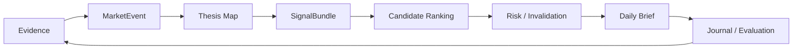
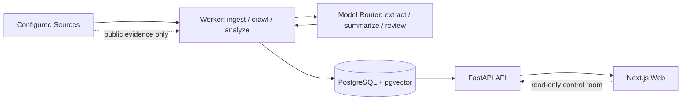
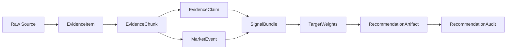

# Project Map

## 1. Product North Star

This is a local-first, advisory-only high-alpha AI infrastructure analyst system. It ingests evidence, extracts `MarketEvent`s, computes deterministic signals, ranks candidates, applies risk and invalidation checks, and produces audited analyst briefs. It never places trades.

## 2. Alpha Analyst Loop

## 3. Runtime Architecture

## 4. Data Lineage

## 5. Module Status Board

| Module | Purpose | Key Specs | Current Status | Tests | Next Action |
| --- | --- | --- | --- | --- | --- |
| governance | Keep agents phase-scoped, advisory-only, and spec-driven | `0001`, `0002`, `0011` | green / verified | `test_architecture_policy.py` | Keep `CURRENT_TASK.md` filled before feature work |
| contracts | Define typed records for evidence, events, signals, recommendations, audits | `0003` | green / verified | `test_contracts_phase1.py`, `test_market_event_contract.py` | Commit/adopt `MarketEvent` in downstream extraction |
| data spine | Own canonical facts in PostgreSQL + pgvector | `0012`, `0015` | green / verified | migration and repository tests | Add event-to-signal persistence only when task requires |
| crawler | Refresh configured AI equity watchlist sources and materialize evidence | `0016`, `0017` | yellow / partial | crawl fetcher, scheduler, logs, seeder tests | Keep Phase 10b scoped to watchlist evidence, not generic crawling |
| MarketEvent extraction | Convert provenance-backed evidence into typed catalyst events | `0003`, `0016`, `0017` | yellow / partial | `test_event_extractor_deterministic.py`, `test_market_event_contract.py` | Align legacy `EquityEvent` output with `MarketEvent` contract |
| model router | Route allowed LLM tasks through config and audit `ModelRun`s | `0004`, `0008` | yellow / partial | `test_model_routing.py`, `test_model_run_repository.py` | Add real calls only behind data-class policy |
| evidence claims | Extract cited claims from evidence chunks | `0003`, `0004`, `0008` | yellow / partial | evidence claim and repository tests | Wire claim extraction to MarketEvent context |
| thesis map | Link catalysts to themes, first-order names, and second-order beneficiaries | `0007`, alpha principles | gray / planned | none dedicated | Define minimal thesis node/edge contract |
| signal engine | Compute deterministic strategic, technical, forward, sentiment, fundamental scores | `0006`, `0009` | yellow / partial | signal, technical, valuation, snapshot tests | Add event-informed feature inputs without LLM scoring |
| risk engine | Apply concentration, drawdown, staleness, contradiction, and invalidation checks | `0002`, `0014` | yellow / partial | portfolio, recommendation policy, evaluation tests | Add explicit invalidation-condition contract |
| recommendation artifact | Publish advisory-only recommendation artifacts with audit links | `0002`, `0003` | green / verified | recommendation builder/API/repository tests | Add daily brief schema on top of artifacts |
| evaluation harness | Backtest, stress, bias-check, and compare recommendation outcomes | `0009` | green / verified | evaluation, benchmark, stress, shadow tests | Connect brief outcomes to journal/evaluation loop |
| API | Validate and expose repositories/read-only feeds | `0015`, module specs | yellow / partial | API route and repository tests | Keep mutation endpoints internal/dev-only |
| worker | Run ingestion, crawl, advisory, and backtest jobs | `0015`, `0017` | yellow / partial | worker, crawl, advisory run tests | Promote local advisory run from sample to governed daily run |
| web UI | Read-only control room, status pages, local journal | `0005`, `0002` | yellow / partial | control-room, trade-journal, parity tests | Add daily high-alpha brief view after schema exists |
| ops room | Surface health, runs, incidents, crawl freshness, and deployment state | `0014`, `0015`, `0017` | yellow / partial | deployment, dashboard, crawl activity tests | Add operational runbook links and incident lifecycle |

## 6. Phase Roadmap

Legend: gray = planned, yellow = partial, green = verified, red = blocked.

| Phase | Scope | Status | Notes |
| --- | --- | --- | --- |
| 0 | governance scaffold and harness | green / verified | Agent rules, spec router, build log, archived plans exist |
| 1 | contracts and schemas | green / verified | Core contracts exist; `MarketEvent` added in current working tree |
| 2 | PostgreSQL + pgvector data spine | green / verified | Migrations and repositories exist; Postgres is canonical |
| 3 | model router and `ModelRun` ledger | yellow / partial | Policy/config and ledger exist; real provider calls remain gated |
| 4 | deterministic signals and portfolio | yellow / partial | Deterministic formulas exist; event-aware signal inputs still developing |
| 5 | evidence ingestion and provenance | yellow / partial | Manual/file evidence and claims exist; source-specific depth is ongoing |
| 6 | recommendation artifacts and audit | green / verified | Advisory-only artifact and publication checks exist |
| 7 | evaluation harness | green / verified | Splits, bias, stress, costs, shadow, repository/API foundations exist |
| 8 | local read-only UI | yellow / partial | Dashboard and pages exist; daily brief surface is pending |
| 9 | advisory run orchestration | yellow / partial | Demo/local runs exist; production daily analyst loop is not complete |
| 10 | equity intelligence crawler/runtime | yellow / partial | Deterministic watchlist crawler exists; Phase 10b deferred |

## 7. Current Task

`docs/CURRENT_TASK.md` exists and is currently a reusable task template, not a filled active task. It requires one small task, one high-alpha product objective, governing specs, exact allowed files, explicit forbidden changes, input/output contracts, acceptance criteria, tests, and Definition of Done.

The most recent implementation task in the working tree is the `MarketEvent` contract and tests. If accepted, the next filled `CURRENT_TASK.md` should advance downstream usage rather than re-open broad crawler or UI work.

## 8. Next 3 Tasks

1. Finalize and commit the `MarketEvent` contract and tests, then update downstream code to consume the contract only where explicitly scoped.
2. Add architecture policy tests for advisory-only and deterministic/LLM boundary gaps not already covered, with small explicit allowlists.
3. Add a minimal daily high-alpha brief schema that links catalysts, tickers, themes, signal IDs, risk flags, invalidation condition, confidence, and advisory label.

## 9. Blockers / Open Decisions

- Exact `MarketEvent` schema: defined in `docs/specs/0003-data-contracts.md` and implemented in `packages/core/src/ai_infra_fund_core/contracts/events.py`; open work is aligning legacy `EquityEvent` extraction output to this contract.
- Event objects in data contracts: yes, `MarketEvent` is now part of the required contract list. Persistence/runtime adoption is still incremental.
- Crawler/runtime status: `0017` says v1 deterministic crawl runtime is implemented; Phase 10b items remain deferred, including JS rendering, provider-specific extractors, real LLM claim extraction, and embedding wiring.
- Canonical vs archived docs: specs are canonical. Plans are temporary or archived. If a plan conflicts with a spec, the spec wins.
- No current hard blocker is marked red, but the system is not yet a complete daily analyst product until MarketEvents feed thesis mapping, deterministic signals, risk/invalidation, daily brief generation, and outcome evaluation end to end.
